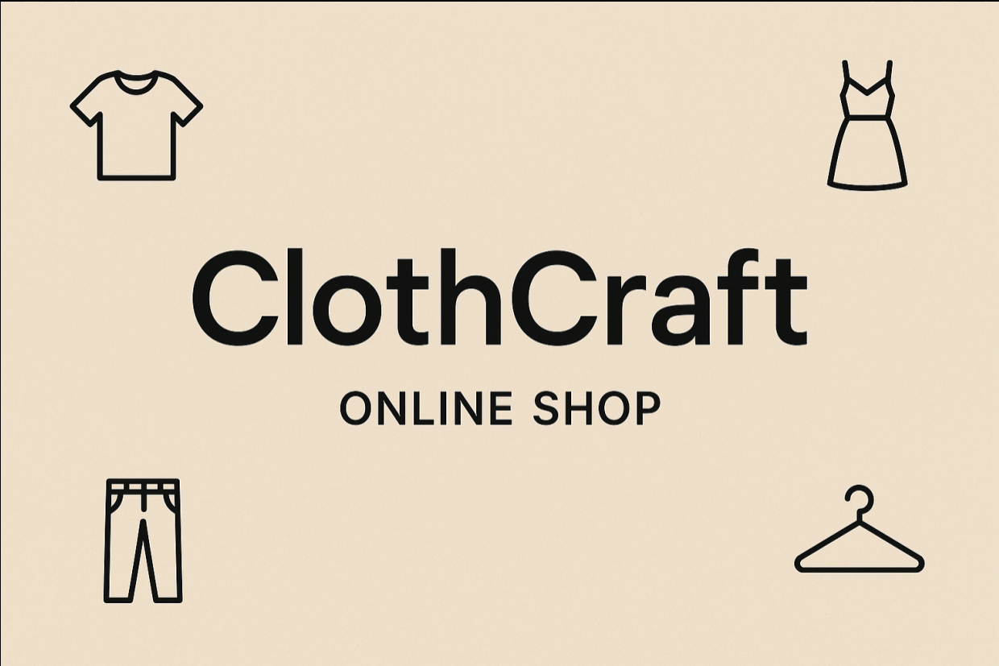
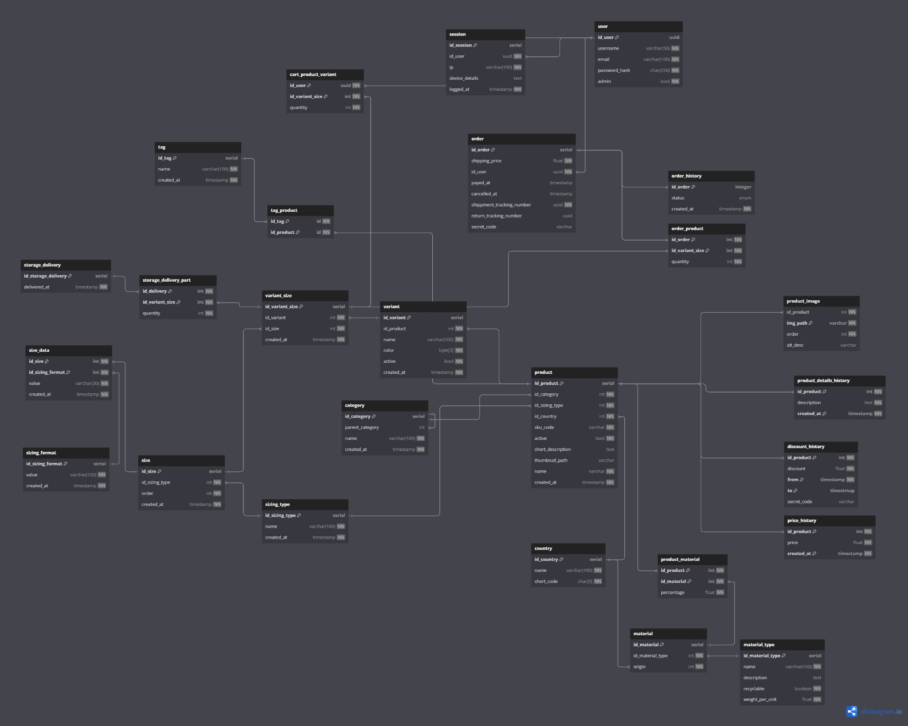

# ClothCraft - online clothing store
This is a full-stack web application built from scratch using FastAPI. All data is stored in a PostgreSQL database, and the frontend is built with Bootstrap and Jinja2 templates. The application features user authentication, product management, and a shopping cart system.

## Authors
We are Theoretical Computer Science students at Jagiellonian University in Kraków, Poland. This project was created as part of our Data Engineering course.
- *Natalia Ignatowicz*, [github](https://github.com/Nope-Nat)
- *Kacper Poneta*, [github](https://github.com/poneciak57)
- *Kacper Orszulak*, [github](https://github.com/SomePersonFromMars)

# Content
- [Try it out](#try-it-out)
  - [Running the application locally](#running-the-application-locally)
  - [Example logins for preview](#example-logins-for-preview)
  - [Showcase gallery](#showcase-gallery)
- [Project description](#project-description)
  - [Features](#features)
  - [Database](#database)
    - [Database schema](#database-schema)
    - [Data origin](#data-origin)


# Try it out
You can try out the application by visiting our [live demo](https://clothcraft.poneciak.com) or by running it locally. 
> If you are accessing the live demo, please do **NOT** delete or modify any data, as it is a shared environment for showcasing the application. If i find out that many users are sabotaging the demo, I will remove access to admin *panel, disable all modifications or take down the demo.

## Running the application locally
1. Clone the repository:
```bash
git clone
```
2. Navigate to the project directory:
```bash
cd clothcraft
```
3. Run the application using Docker Compose:
```bash
docker compose up -d --build
```
4. Access the application in your web browser at `http://localhost:8080`.

## Example logins for preview

### Normal Users
email: 
- johnsmith@example.com
- janedoe@example.com
- emilyc@example.com
- aliceh@example.com
password: 12345678

### Admin User
email: alexbrown@example.com
password: 12345678

## Showcase gallery
TODO: Add screenshots of the application in action.


# Project description
## Features
This project was focused on extensive database design and implementation, so it may lack some features that are common in production applications. However, it includes the following functionalities:
- User authentication (registration, login, logout)
- Product management (CRUD operations)
- Shopping cart system
- Order management
- Admin panel for managing products and orders
- Rich filtering

## Database
This project focused on extensive database design and implementation. It contains:
- triggers
- views
- rules
- functions
- indexes
- 20+ tables 
- A lot of example data

Everything can be found [here](/db/init_updt/)

### Database schema


## Data origin
Most of the data was generated using OpenAI API, with some additional data manually added to ensure a realistic dataset. The data includes:
- users
- products
- product variants
- sizings
- orders
- shopping carts
- product categories
- materials
- tags
- product images (also generated using SoraAI)
